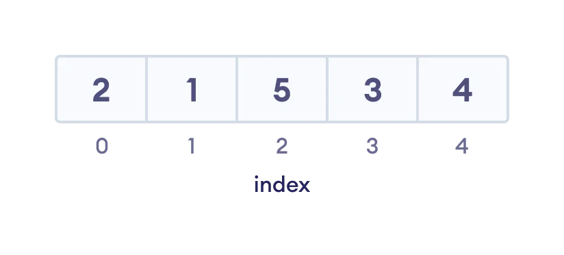
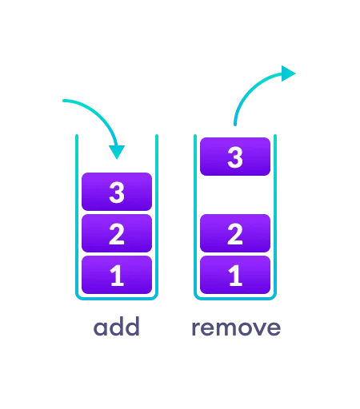
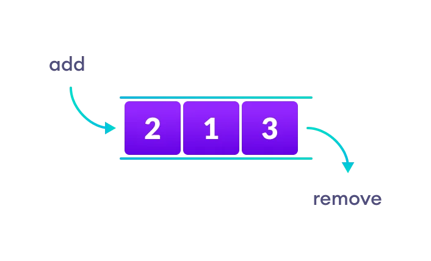
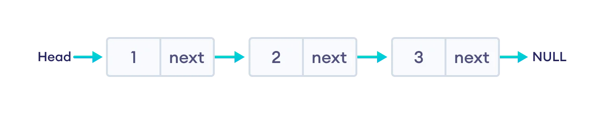
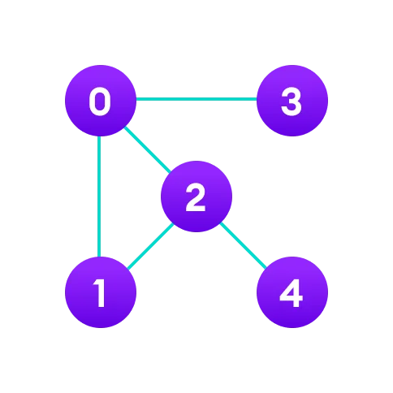
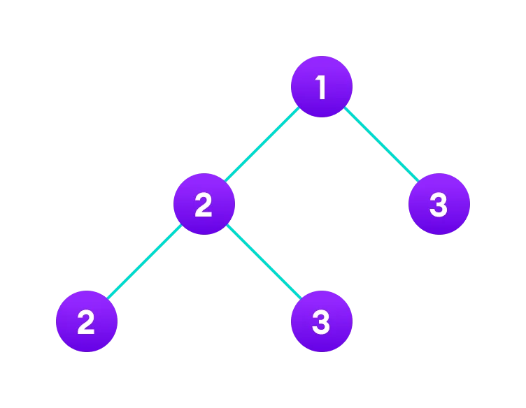

# Data Structure and Types.

## What are Data Structures?
 
 Data Structure is a storage that is used to store and organize data. It is a way of arranging data so that it can be accessed and modified in an efficiently way.
 
 The type of Data Structures that we will use depends on the project that we are doing. If for example, we need to store and access our data in sequence, then we should go for the Array data structure.
 
 
 

 We should keep in mind that when we talk about Data structure, and Data types, a Data structure is a collection of data types arranged in a specific order.
 

## Types of Data Structure
 Data Structures are divided into two categories:
 
 - Linear data structure
 - Non-linear data structure
 
### Linear data structures
 In linear data structures, the elements are arranged in sequence, one after the other. Because of the way each element is arranged one after the other, this kind of data structures are easy to implement. 
 
 But when the complexity of the program increase, this might not be the best option because of operational complexities.
 
 **Some popular linear data structures are:**
 
#### 1. Array Data Structure.
 In an array the elements in memory are arranged in continuous memory. All the elements of an array should be of the same type. And the type of elements that can be store in the form of arrays is determined by the programming language. For example, in c++ the restriction of the same type of elements through the array is important, because arrays are stored in consecutive memory cells, so every cell must be the same type.
 
 
 
#### 2. Stack Data Structure
 In stack data structure, elements are stored based in the **Last In First Out (LIFO) principle** that is the last element stored in a stack will be removed first.
 
 We could think of it like a pile of plates. The last plate is the one we are gonna take to wash. In that sense, to wash the plate at the bottom, we must wash (remove) all the other plates that are on top of it.
 
 
 
 There are some basic operations that allow us to perform different actions on a Stack Data Structure.
 
 - **Push:** Add an element to the top of a stack.
 - **Pop:** Remove an element from the top of a stack.
 - **IsEmpty:** Check if the stack is empty.
 - **isFull:** Check if the stack is full.
 - **Peek:** Get the value of the top element without removing it.
 
#### 3. Queue Data Structure
 Unlike stack, the Queue data structure works in the **First In First Out (FIFO) principle**, that means, that the first element stored in the queue will be removed first.
 
 We could imagine it like a real and normal queue. The first person to enter in the queue will be the first person to purchase the ticket or whatever good you are doing the queue for.
 
 
 
 The basic operations that can be performed in a Queue Data Structure are the followings:
 
 - **Enqueue:** Add an element to the end of the queue
 - **Dequeue:** Remove an element from the front of the queue
 - **isEmpty:** Check if our queue is empty
 - **isFull:** Check if our queue is full
 - **Peek:** Get the value of the top element (the element at the front of the queue) without removing it
 
#### 4. Linked List Data Structure
 In a linked list data structure, the data elements are connected through a series of nodes. And, each node contains the data items, and the address to the next node.
 
 We usually tend to give the address of the first node the special name `HEAD`, also, we can know which node is the last one because its **next** address points to `null`
 
 There are multiple types of linked list, like:
 
  - Singly
  - Doubly
  - Circular linked list.
  
 If it help us, we can think of a linked list like one of those hunt games where each clue includes the information to find the next clue.
 
 
 
### Non-linear data structures

 Unlike linear data structures, elements in non-linear data structures are **not** in any sequence. Instead they are arranged in a hierarchical manner where one element will be connected to one or more elements.
 
 Non-linear data structures are further divided between **graph** and **tree** based data structures.
 
#### 1. Graph Data Structure

 In a graph data structure, each node is called **vertex** and each vertex is connected to other vertices throught edges. 
 
 each **vertex** contains data.
 
 We could think of it like a link chart that some detective uses to investigate a case. This link chart will have some node that points to multiples nodes, as well as it can also have a node that points to none.
 
 
 
#### 2. Trees Data Structure
 Similar to graph, a tree data structure is a collection of nodes and edges. The difference is that in this data structure the can only be one edge between to vertices.
 
 
 
 
 
### Major differences between Linear and Non-linear Data Structures

| Linear Data Structures      | Non-linear Data Structures |
| ----------- | ----------- |
|The data elements are arranged in a sequential order, that is, one after the other.| The data elements are arranged in non-sequential order, that is, in a hierarchical manner.|
|All the items are present in a single layer|The items are present at different layers|
|It can be traversed on a single run, that means that if we start from the first element, we can go through all the elements until we reach the last element.|It requires multiples runs, that means that if we start from the first element, it might not be possible to go through all the other elements in a single pass.|
|The memory utilization is not efficient.|The different structures use the memory in different ways depending of the need.|
|The time complexity increases with the data size|Time complexity remains the same|
|Examples of this kind of Data Structures are: Array, Stack, Queue.|Examples of this kind of Data Structures are: Tree, Graph, Map|