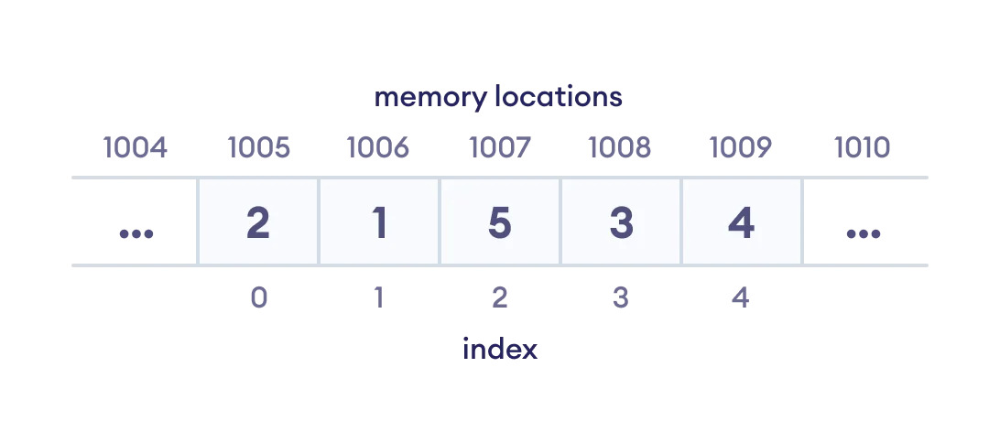

# Data Structure and Types.

## Learning Outcome:
1. What are Data Structures?
2. Types of Data Structures

## What are Data Structures?
 
 Data Structure is a storage that is used to store and organize data. It is a way of arranging data so that it can be accessed and modified in an efficiently way.
 
 The type of Data Structures that we will use depends on the project that we are doing. If for example, we need to store and access our data in sequence, then we should go for the Array data structure.
 
 
 

 We should keep in mind that when we talk about Data structure, and Data types, a Data structure is a collection of data types arranged in a specific order.
 

## Types of Data Structure
 Data Structures are divided into two categories:
 
 - Linear data structure
 - Non-linear data structure
 
### Linear data structures