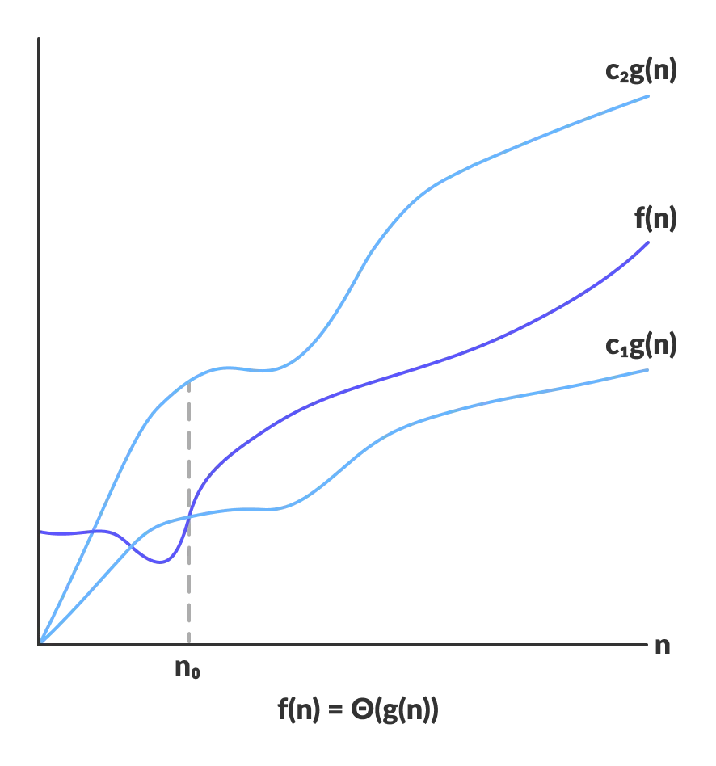

# Asymptotic Analisis

> In mathematics an asymptotic line is a line that gets closer and closer to a curve as the distance that it goes through tends or get close to infinity.

> (Of a function) Approaching a given value as an expression containing a variable tends to infinity.

 The efficiently of an algorithm depends on the time, space, and others resources that it needs to run or execute the algorithm itself. The efficiently of an algorithm is measured with the help of the **Asymptotic Analisis**
 
 The Asymptotic Analysis is the study of the changes in the performance of an algorithm as the size of it input also changes.
 
 **The performance of an algorithm** is not always constant, as it can change in based to the size of the input of our algorithm, although there are some algorithms knowns as **constant-time algorithms** whose performance don't depend on the size of the input.

## Asymptotic notations
 Asymptotic notations are the mathematical notation used to represent or to describe the running of an algorithm when the input tends towards a certain value or limit.
 
 In the *Bubble sort* algorithm --which is a sorting algorithm that help us sorting an array incrementally. 		such that if two elements are adjacents and  **n<sub>0</sub> > n<sub>1<sub>** swaps the order of the elements such that now **n<sub>0</sub> < n<sub>1</sub>** -- when the input array is already sorted the time that it takes to run is linear, *i.e* **the best case complexity.**
 
 On the contrary when our input is in a reversed order (decrementally for example) then the running of the bubble sort algorithm will take the maximum time to sort the elements *i.e* **the worst case complexity.**
 
 If our input array is neither sorted nor reversed, it will take an average time for our bubble sort to sort the elements of the array. These durations are denoted using asymptotic notations.
 
 There are mainly three asymptotic notations:
### Big-O (O-notation)
 Represents the upper bound of the running time that our given algorithm takes. **It gives the worst case complexity**
 
 
 
 ```
 O(g(n)) = { f(n): there exist positive constants c and n0 
such that 0 <= f(n) <= cg(n) for all n >= n0 }
 ```
### Omega notation (Ω-notation)
 Represents the lower bound of the running tima that our algorithm takes. *i.e* **The worst case complexity**
 
 

 ```
 Ω(g(n)) = { f(n): there exist positive constant c and n0
 such that 0 <= cg(n) <= f(n) for all n >= 0 }
 ```
### Theta notation (Θ-notation)
 Represents both bound, the upper and the lower. And its because of this that this notation is usually used to represent the average time that a given algorithm takes to run. *i.e* **The average case complexity**
 
 
 


```
Θ(g(n)) = { f(n): there exist positive constants c1, c2 and n0
such that 0 <= c1g(n) <= f(n) <= c2g(n) for all n >= n0 }
```

 In the case that our function `f(n)` that belongs to the set `Θ(g(n))` has the positive constants c<sub>1</sub>, c<sub>2</sub> such that `f(n)` lies in between c<sub>1</sub>g(n) and c<sub>2</sub>g(n) for all `n >= n0` then `f(n)` is said to be asymptotically tight bound.